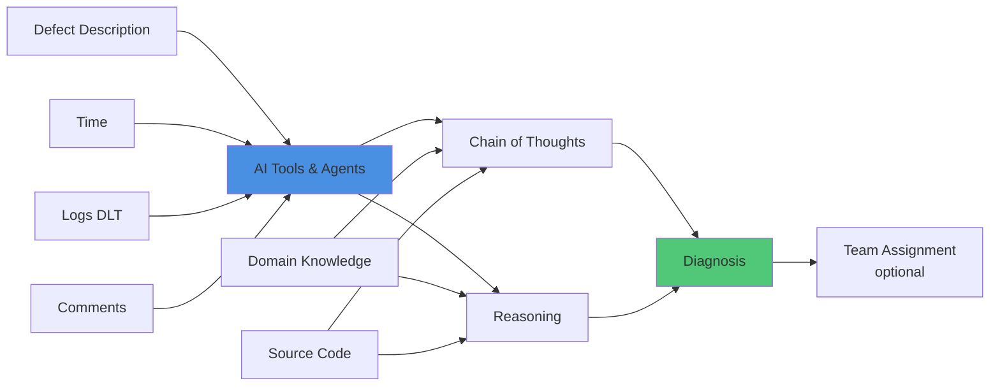

# AI Agent for Root Cause Analysis

**AI-Powered Root Cause Analysis**

## Overview

An AI-powered system that analyzes bugs using multiple data sources and smart reasoning to automatically diagnose issues and recommend the right team to fix them.

## Problem Statement

Software bugs and issues are common in all systems. Finding and fixing them is one of the most difficult and time-intensive tasks. Teams face several key challenges:

### Current Challenges

1. **Manual Analysis Takes Too Long**
   - Engineers spend hours reviewing logs and bug reports manually
   - First review and assignment can take hours or even days
   - Switching between tasks slows down work

2. **Knowledge Gaps**
   - Only a few people know how to fix certain problems
   - When experts are busy, problems take longer to solve
   - New team members take time to learn everything

3. **Different Results Each Time**
   - Different engineers analyze the same bug differently
   - Easy to miss important patterns when doing manual checks
   - No standard way to investigate problems

4. **Scattered Information**
   - Important data is spread across logs, comments, code, and documents
   - Hard to connect information from different places
   - Difficult to spot patterns over time

5. **Finding the Real Problem Takes Time**
   - Often confuse symptoms with actual causes
   - May need multiple rounds of investigation
   - Takes too long to fix issues (high MTTR)

6. **Wrong Team Assignment**
   - Bugs sent to wrong teams, causing delays
   - Hard to know which team has the right skills
   - Important issues may not get urgent attention

## Impact After Using the RCA Tool

The AI Agent for Root Cause Analysis changes how you handle and fix bugs, bringing clear improvements in many areas:

### Day-to-Day Impact

1. **Fix Issues Much Faster**
   - 60-80% less time spent on initial review
   - Find root causes faster with automated analysis
   - Handle multiple bugs at the same time

2. **Fix It Right the First Time**
   - Correct diagnosis means fewer wrong fixes
   - Get confidence scores with each diagnosis
   - Fewer bugs coming back after fixing

3. **Teams Get More Done**
   - Engineers solve problems instead of just investigating
   - Less switching between different tasks
   - Senior engineers can focus on harder problems

### Quality Impact

4. **Same Quality Every Time**
   - Standard way to investigate all bugs
   - No human mistakes from tiredness or bias
   - Complete analysis that catches important patterns

5. **Spot Patterns Better**
   - Find bugs that keep happening
   - Connect related bugs that seem different
   - See trends in system-wide issues

6. **Share Knowledge Across Team**
   - Everyone can access expert knowledge
   - Less dependent on specific people
   - New team members learn faster

### Business Impact

7. **Save Money**
   - Lower costs for investigating bugs
   - Less system downtime
   - Fewer urgent escalations

8. **Happier Customers**
   - Fix issues faster for better user experience
   - Prevent problems before customers see them
   - Explain issues clearly with evidence

9. **Handle More Work**
   - Process more bugs without hiring more people
   - Same quality no matter how big the team
   - Works 24/7 without breaks

### Long-Term Impact

10. **Make Better Decisions**
    - Get data on bug patterns and trends
    - Find risky areas that need attention
    - Track return on quality improvements

11. **Keep Getting Better**
    - System learns from every fix
    - Knowledge base grows over time
    - Continuous process improvements

12. **Stay Ahead of Competition**
    - Release faster with better quality
    - Build reputation for reliability
    - Focus on innovation instead of fixing fires

### Results in Numbers

| What We Measure | Before RCA Tool | After RCA Tool | Improvement |
|--------|----------------|----------------|-------------|
| Time for Initial Review | 4-6 hours | 15-30 minutes | 85-90% faster |
| Time to Fix Issues | 2-5 days | 0.5-1.5 days | 60-70% faster |
| Bugs Sent to Wrong Team | 25-30% | 5-10% | 70-80% less |
| Correct Diagnosis | 60-70% | 85-95% | 25-35% better |
| Team Productivity | Baseline | +40-50% | Much better |
| Bugs Coming Back | 15-20% | 5-8% | 60-70% less |

## System Architecture

## Components

### Input Layer

The system takes in different types of data to fully understand the bug:

#### 1. **Bug Description**
- Written description of the problem
- What users reported
- What should happen vs. what actually happens

#### 2. **Time Information**
- When the bug occurred
- How long and how often it happens
- Time-based patterns

#### 3. **Logs (DLT)**
- Diagnostic and trace data
- Application logs
- System logs
- Error messages
- Performance data

#### 4. **Comments**
- User feedback
- Developer notes
- History and context
- Related discussions

### Processing Layer

#### AI Tools & Agents
The smart core that runs the analysis:

- **Multiple AI Agents**: Different agents handle different types of analysis
- **Team Work**: Agents work together to analyze data
- **Tool Integration**: Uses various AI tools for analysis

#### Chain of Thoughts
- **Step-by-Step Thinking**: Logical analysis from start to finish
- **Break Down Problems**: Split complex bugs into smaller pieces
- **Test Ideas**: Create and test possible causes
- **Keep Improving**: Get better with more evidence

#### Reasoning Engine
- **Find Causes**: Determine what caused what
- **Spot Patterns**: Recognize known bug patterns
- **Detect Unusual Things**: Find strange behaviors
- **Connect the Dots**: Link information from different sources

### Knowledge Layer

#### Domain Knowledge
- **Best Practices**: Standard solutions and patterns
- **Past Issues**: Previous bugs and how they were fixed
- **Product Knowledge**: How the system is built and designed
- **Documentation**: Specifications and requirements

#### Source Code
- **Code Analysis**: Examine code for problems
- **Dependencies**: Understand how components connect
- **Version History**: Track code changes over time
- **Code Patterns**: Recognize common coding mistakes

### Output Layer

#### Diagnosis
The main output with:
- **Root Cause**: What actually caused the bug
- **Impact Level**: How serious and widespread the issue is
- **Confidence Score**: How certain the AI is about the diagnosis
- **Evidence**: Data and reasoning that support the diagnosis
- **Next Steps**: What to do to fix the bug

#### Team Assignment (Optional)
Smart routing of bugs to the right teams:
- **Match Skills**: Assign based on required expertise
- **Balance Work**: Distribute tasks evenly
- **Priority Handling**: Send urgent issues to the right place
- **Team Suggestions**: Recommend best teams or people

## How It Works

1. **Collect Data**: System gathers all inputs (bug description, logs, comments, timestamps)

2. **Start AI Agents**: Right agents are activated based on the type of bug

3. **Access Knowledge**: Agents look at domain knowledge and source code

4. **Think Through the Problem**: 
   - Agents reason step-by-step
   - Come up with possible causes
   - Test against evidence
   - Refine conclusions

5. **Analyze Everything**:
   - Connect data from different sources
   - Use expert knowledge
   - Check code patterns
   - Find the root cause

6. **Create Diagnosis**:
   - Put findings together
   - Give detailed diagnosis
   - Show confidence level
   - Suggest how to fix it

7. **Assign to Team** (if enabled):
   - Match bug with team skills
   - Recommend best team
   - Explain why

## Key Features

### 🧠 Smart Analysis
- Process multiple types of data
- Advanced AI reasoning
- Understands context

### 🔍 Complete Coverage
- Analyze logs, code, and text
- Connect events over time and location
- Match against past patterns

### ⚡ Automated Process
- Less manual review time
- Same analysis method every time
- Handles high volume

### 🎯 Clear Actions
- Diagnosis with evidence
- What to do next
- Which team should handle it

## Technology Stack

### AI/ML Components
- Large Language Models (LLMs) for text analysis
- Log analysis and anomaly detection
- Multi-agent orchestration framework

### Data Processing
- DLT (Diagnostic Log and Trace) processing
- Natural Language Processing (NLP)
- Time-series analysis
- Graph-based reasoning

### Knowledge Management
- Vector databases for domain knowledge
- Code indexing and search
- Documentation retrieval
- Historical defect database

## Benefits

1. **Fix Faster**: Automated analysis saves time
2. **More Accurate**: AI reduces human mistakes
3. **Better Use of People**: Smart team assignment balances workload
4. **Keep Knowledge**: System learns from past bugs
5. **Handle More**: Process more bugs without adding people

## Integration Points

- **Defect Tracking Systems**: JIRA, Azure DevOps, etc.
- **Log Aggregation Platforms**: Splunk, ELK Stack, etc.
- **Version Control**: Git, GitHub, GitLab, etc.
- **Documentation Systems**: Confluence, SharePoint, etc.
- **Communication Tools**: Slack, Teams, Email, etc.

## Future Plans

- **Image & Video Analysis**: Add ability to analyze screenshots and screen recordings
- Predict bugs before they happen
- Auto-fix some problems
- Better visual dashboards
- Connect with build and deployment tools
- Keep learning from every fix

---

*AI-powered detective work for defect analysis and root cause identification*
